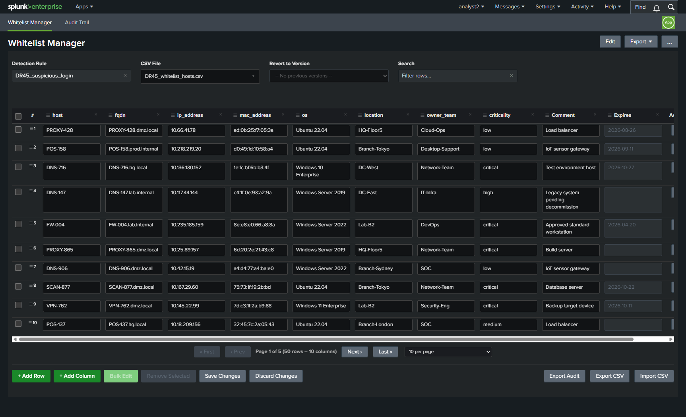
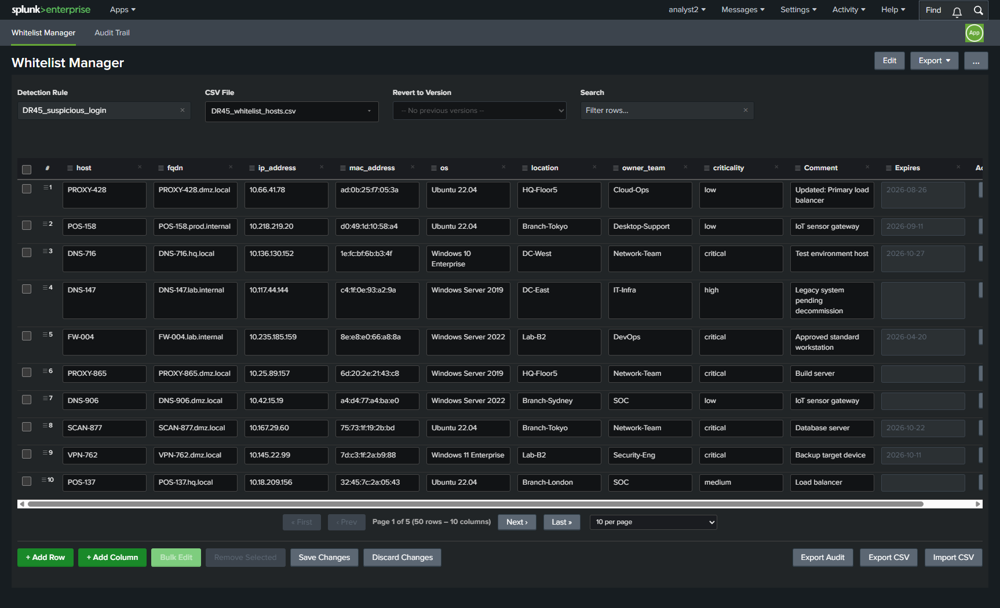
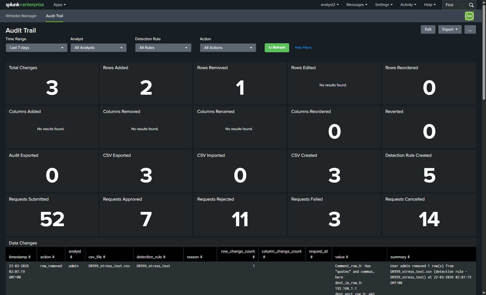
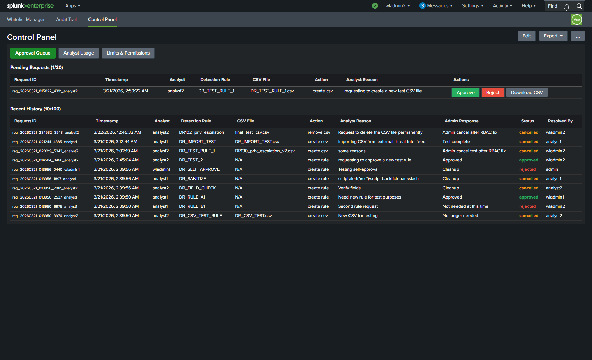

# Whitelist Manager for Splunk

[](https://github.com/RelativisticJet/wl_manager/releases)
[](LICENSE)
[](https://www.splunk.com/)
[](https://www.python.org/)

Manage detection-rule CSV whitelists through a web UI with inline editing, approval workflows, version control, and a full diff-based audit trail.

Built for SOC teams who need to manage detection rule exceptions without touching raw CSV files or Splunk configs.

## Screenshots

**Main Dashboard** — Inline editing with change tracking, search, pagination, and bulk operations



**Inline Editing** — Click any cell to edit. Modified cells are highlighted for review before saving.



**Audit Trail** — Complete audit dashboard with summary stats, filters, and approval tracking



**Control Panel** — Admin-only dashboard for approval queue, analyst usage, and limit configuration



## Features

### Core Editing

- Inline cell editing with change tracking (before/after diffs)
- Add, remove, and bulk-edit rows with required comments
- Add and remove columns
- Row drag-and-drop reordering
- CSV import/export
- Search and filter rows
- Dark and light theme support

### Approval Workflows

- Configurable thresholds trigger admin approval for bulk operations
- Daily usage limits per analyst (row removals, edits, additions, reverts)
- Admins approve/reject/cancel requests from the Control Panel
- Self-approval prevention — submitter cannot approve their own request

### Version Control

- Every save creates a timestamped snapshot (last 6 versions retained)
- Revert to any previous version with full audit trail
- Optimistic locking — concurrent edits detected via file mtime

### Audit Trail

- Every change logged to a dedicated `wl_audit` Splunk index
- Diff-based events: added, removed, edited, revert, auto-removed
- Per-field before/after values for edits
- Dashboard with summary stats, filters by analyst/rule/action/time
- Expiring-soon panel for proactive review

### Security

- Role-based access control: `wl_admin`, `wl_analyst_editor`, `wl_analyst_viewer`
- Server-side RBAC enforcement on every request
- Path traversal protection, input sanitization, rate limiting
- Control Panel restricted to admin roles

### Row Expiration

- Set expiration dates with presets (7d, 30d, 6mo, 1yr) or custom date/time
- Expired rows auto-removed on CSV load and via hourly scheduled cleanup
- Expiring-soon alerts in the Audit Trail dashboard

## Quick Start

### Docker Demo (Try Before Installing)

```bash
# Clone and start
git clone https://github.com/RelativisticJet/wl_manager.git
cd wl_manager
docker compose up -d

# Wait ~90 seconds for Splunk to start, then open:
# http://localhost:8000  (admin / Chang3d!)
```

Navigate to **Apps > Whitelist Manager** to start using the app.

### Install on Existing Splunk

Download the latest `.spl` from the [Releases](https://github.com/RelativisticJet/wl_manager/releases) page.

**Option A — Splunk Web UI:**

1. Go to **Apps > Manage Apps > Install app from file**
2. Upload `wl_manager-2.0.0.spl`
3. Restart Splunk when prompted

**Option B — CLI:**

```bash
$SPLUNK_HOME/bin/splunk install app wl_manager-2.0.0.spl
$SPLUNK_HOME/bin/splunk restart
```

**Option C — Manual:**

```bash
tar -xzf wl_manager-2.0.0.spl -C $SPLUNK_HOME/etc/apps/
chown -R splunk:splunk $SPLUNK_HOME/etc/apps/wl_manager
$SPLUNK_HOME/bin/splunk restart
```

## Post-Installation Setup

### 1. Create User Roles

The app ships with three roles in `authorize.conf`. Assign them to your users via **Settings > Access Controls > Roles**:

| Role | Can View | Can Edit | Control Panel | Inherits |
|------|----------|----------|---------------|----------|
| `wl_admin` | Yes | Yes | Yes | `power` |
| `wl_analyst_editor` | Yes | Yes | No | `power` |
| `wl_analyst_viewer` | Yes | No | No | `user` |

Legacy roles `wl_editor` and `wl_viewer` are supported for backward compatibility.

### 2. Map Your Detection Rules

Edit `lookups/rule_csv_map.csv` to map your detection rules to CSV lookup files:

```csv
rule_name,csv_file,app_context
DR20_malicious_command,DR20_whitelist.csv,wl_manager
DR55_brute_force_login,DR55_brute_force_users.csv,wl_manager
```

- `rule_name` — display name in the Detection Rule dropdown
- `csv_file` — the CSV lookup file in the app's `lookups/` directory
- `app_context` — the Splunk app containing the CSV (usually `wl_manager`)

The app ships with 18 sample detection rules. Replace or extend these with your own.

### 3. Verify the Audit Index

The app creates a `wl_audit` index automatically via `indexes.conf`. Verify it exists:

```spl
| eventcount index=wl_audit
```

### 4. Configure Daily Limits (Optional)

Admins can configure per-analyst daily limits from the **Control Panel > Limits & Permissions** tab:

- Row additions, removals, edits (default: 10/day each)
- Column additions and removals (default: 2/day each)
- Reverts (default: 3/day)
- Approval thresholds for bulk operations (default: 3+ rows)

## Architecture

```text
wl_manager/
  bin/wl_handler.py              # REST handler (all server logic)
  appserver/static/
    whitelist_manager.js          # Main dashboard controller
    whitelist_manager.css         # Styles (dark/light theme)
    control_panel.js              # Admin Control Panel
    notifications.js              # Approval notification system
  default/
    app.conf                      # App metadata
    restmap.conf                  # REST endpoint config
    authorize.conf                # RBAC role definitions
    indexes.conf                  # wl_audit index
    savedsearches.conf            # Expiration alert
    data/ui/views/
      whitelist_manager.xml       # Main dashboard
      audit.xml                   # Audit trail dashboard
      control_panel.xml           # Admin panel
  lookups/
    rule_csv_map.csv              # Detection rule -> CSV mapping
```

### How It Works

1. **Frontend** (JavaScript + jQuery) builds the entire UI dynamically inside Splunk SimpleXML panels
2. **Backend** (`wl_handler.py`) is a `PersistentServerConnectionApplication` handling GET/POST at `/custom/wl_manager`
3. **Diff engine** uses similarity-based matching to correctly detect edits even when rows are simultaneously removed
4. **Audit events** are written directly to the `wl_audit` index via Splunk's REST API
5. **Version snapshots** are stored in `lookups/_versions/` with a JSON manifest

## Development

### Prerequisites

- Docker and Docker Compose
- Git Bash (Windows) or any Unix shell
- Python 3.9+ (for validation)

### Development Workflow

```bash
# Start dev environment
make docker-up
make docker-wait

# After code changes
make validate         # Run AppInspect-style checks
make test             # Run integration tests

# Build release package
make package          # Outputs dist/wl_manager-VERSION.spl
```

### Adding a New Detection Rule

1. Create a CSV file in `lookups/` with your column headers
2. Add a row to `lookups/rule_csv_map.csv`
3. The new rule appears in the dashboard dropdown immediately (no code changes needed)

## Requirements

- Splunk Enterprise 8.x or 9.x (tested on 9.3.1)
- Python 3 (bundled with Splunk 8+)
- ~10 MB disk space for the app + audit data

## License

MIT License. See [LICENSE](LICENSE) for details.

## Contributing

Issues and pull requests welcome at [github.com/RelativisticJet/wl_manager](https://github.com/RelativisticJet/wl_manager).
